# Machine Learning Specialization
### Specialization by Deeplearning.AI on Coursera

Repository which contains my notes, practices, code, and explanations to Coursera's "Machine Learning Specialization" by Deeplearning.AI taught by Andrew NG

### Machine Learning: Supervised vs. Unsupervised Learning

```mermaid
graph TD
    A[<b>📊 Machine Learning</b>] --> B[<b>🌟 🟦 SUPERVISED LEARNING</b>]
    A --> C[<b>Unsupervised Learning</b>]

    %% Supervised Learning Branch (Highlighted)
    B --> D["<b>🚀 Definition:</b> Learns from <i>labeled data</i><br><b>🎯 Goal:</b> Predict future outcomes"]
    D --> E["<b>🔷 Key Algorithms:</b><br> - <b>Linear/Logistic Regression</b><br> - <b>Decision Trees</b><br> - <b>Random Forest</b><br> - <b>SVM</b><br> - <b>Neural Networks</b>"]
    D --> F["<b>💡 Use Cases:</b><br> - <b>Spam Detection</b><br> - <b>Image Classification</b><br> - <b>Price Prediction</b>"]

    %% Unsupervised Learning Branch (Subdued)
    C --> G["Definition: Finds patterns in <i>unlabeled data</i><br>Goal: Discover hidden structures"]
    G --> H["Algorithms:<br> - K-Means Clustering<br> - PCA<br> - Apriori<br> - Autoencoders<br> - DBSCAN"]
    G --> I["Use Cases:<br> - Customer Segmentation<br> - Anomaly Detection<br> - Recommendation Systems"]

    %% Styling
    classDef highlight fill:#e6f3ff,stroke:#0066cc,stroke-width:4px,color:#003366,font-weight:bold
    classDef subdued fill:#f5f5f5,stroke:#cccccc,stroke-width:1px,color:#666666
    classDef def fill:#f0f7f4,stroke:#2e856e,stroke-width:2px
    classDef algo fill:#e6f9ff,stroke:#0086b3,stroke-width:1.5px
    classDef usecase fill:#fff0e6,stroke:#cc5200,stroke-width:1.5px

    class B,D,E,F highlight
    class C,G,H,I subdued
    class D,G def
    class E,H algo
    class F,I usecase
```
