# Supervised Machine Learning: Regression and Classification
### Certification by Deeplearning.AI on Coursera

Repository which contains my notes, practices, code, and explanations to Coursera's "Supervised Machine Learning: Regression and Classification" by Deeplearning.AI taught by Andrew NG

### Machine Learning: Supervised vs. Unsupervised Learning

```mermaid
graph TD
    A[<b>📊 Machine Learning</b>] --> B[<b>🟦 Supervised Learning</b>]
    A --> C[<b>🟧 Unsupervised Learning</b>]

    %% Supervised Learning Branch
    B --> D["<b>Definition:</b> Learns from <i>labeled data</i> (input-output pairs)<br> <b>Goal:</b> Predict future outcomes"]
    D --> E["<b>🔷 Algorithms:</b><br> - Linear/Logistic Regression<br> - Decision Trees<br> - Random Forest<br> - SVM<br> - Neural Networks"]
    D --> F["<b>🎯 Use Cases:</b><br> - Spam Detection<br> - Image Classification<br> - Price Prediction"]

    %% Unsupervised Learning Branch
    C --> G["<b>Definition:</b> Finds patterns in <i>unlabeled data</i><br> <b>Goal:</b> Discover hidden structures"]
    G --> H["<b>🔶 Algorithms:</b><br> - K-Means Clustering<br> - PCA<br> - Apriori<br> - Autoencoders<br> - DBSCAN"]
    G --> I["<b>🌌 Use Cases:</b><br> - Customer Segmentation<br> - Anomaly Detection<br> - Recommendation Systems"]

    %% Styling
    classDef supervised fill:#e6f3ff,stroke:#0066cc,stroke-width:2px,color:#003366
    classDef unsupervised fill:#ffede6,stroke:#ff6600,stroke-width:2px,color:#662900
    classDef def fill:#f0f7f4,stroke:#2e856e,stroke-width:2px
    classDef algo fill:#e6f9ff,stroke:#0086b3,stroke-width:1.5px
    classDef usecase fill:#fff0e6,stroke:#cc5200,stroke-width:1.5px

    class B,D,E,F supervised
    class C,G,H,I unsupervised
    class D,G def
    class E,H algo
    class F,I usecase
```
